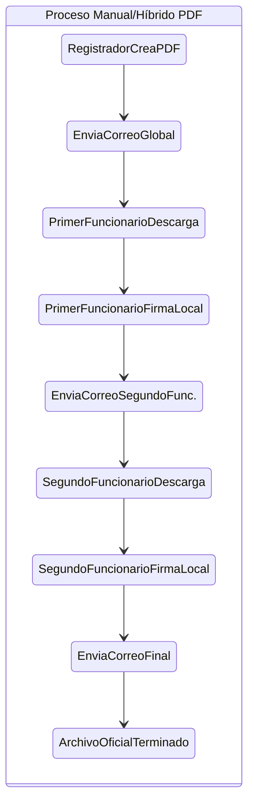
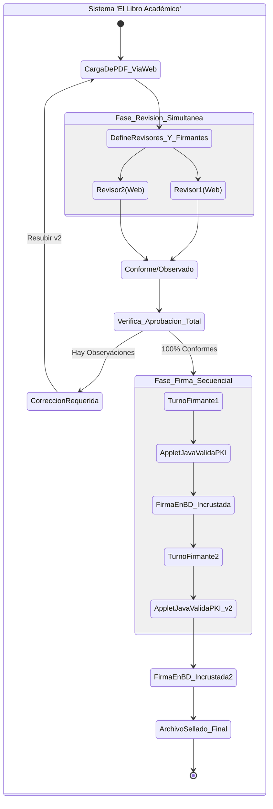
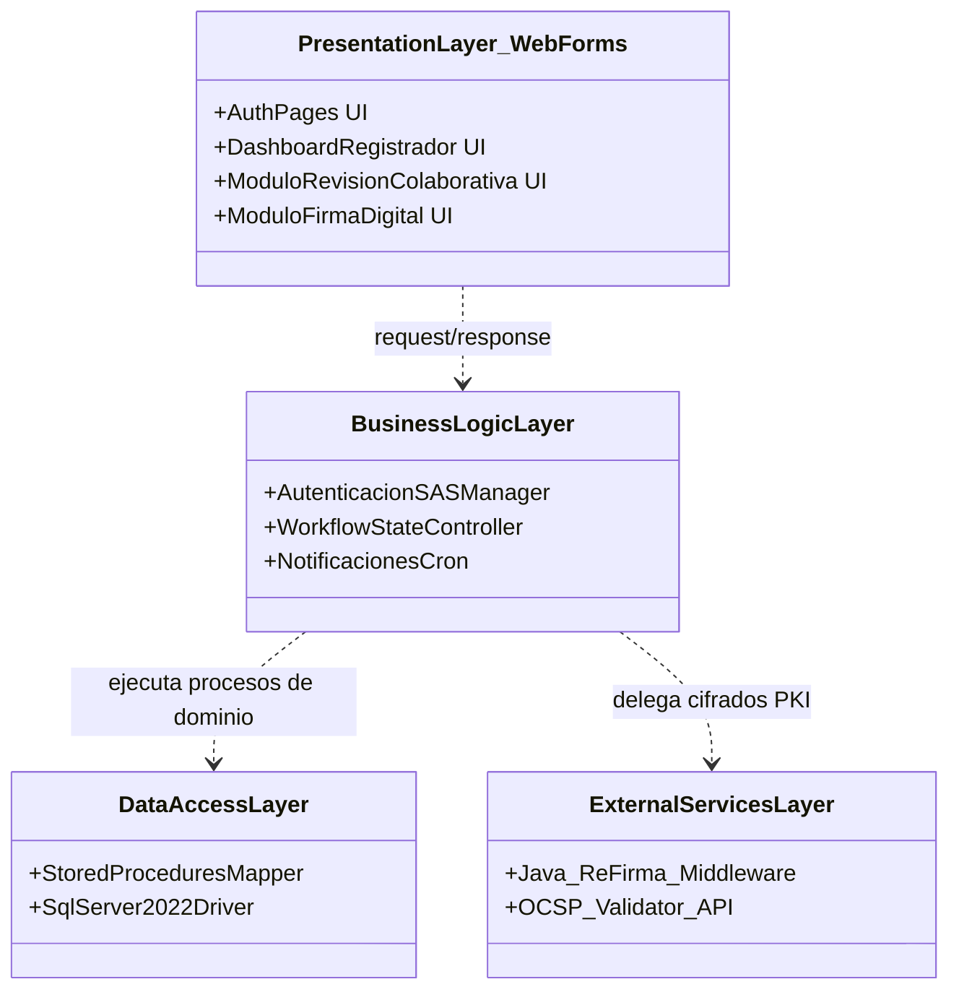
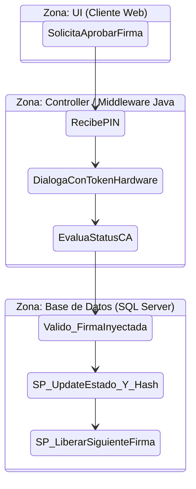
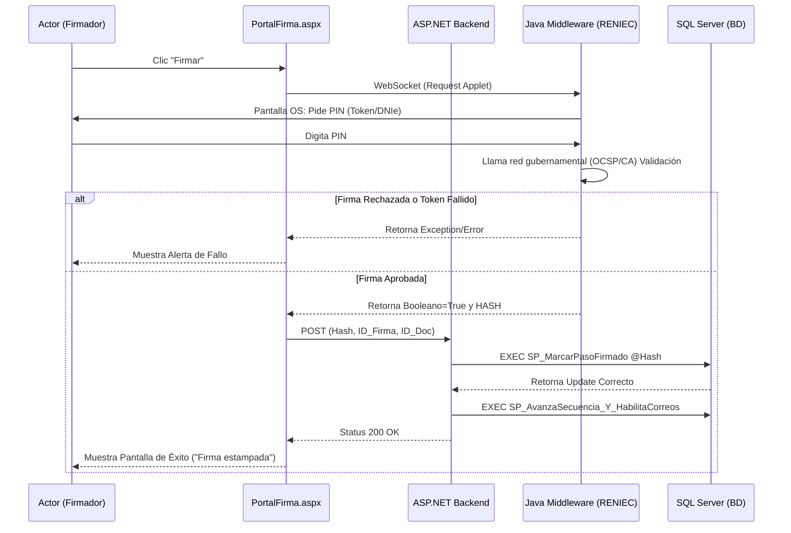

# Especificación y Diseño del Sistema de Firmado Digital de Documentos ("El Libro Académico")

## INTRODUCCIÓN
El presente documento contiene el análisis, diseño y especificación técnica del **Sistema de Firmado Digital de Documentos**, una solución web concebida para reemplazar el manejo manual de resoluciones y actas dentro de la institución. En este archivo se unifican las visiones del negocio, la reingeniería de procesos y la fase de desarrollo orientada a objetos correspondientes al software diseñado.

---

## I. Generalidades de la Empresa

### 1. Nombre de la Empresa
Universidad Privada de Tacna (UPT), referenciando el contexto institucional de desarrollo en la Carrera de Ingeniería de Sistemas.

### 2. Visión
Ser una institución de educación superior universitaria reconocida por su excelencia académica, investigación científica y compromiso con el desarrollo sostenible y la transformación digital de la región sur del país. *(Nota: Visión referencial adaptada para el contexto del sistema)*.

### 3. Misión
Formar profesionales líderes, éticos e innovadores mediante una educación de calidad, contribuyendo al desarrollo de la sociedad a través de la digitalización y optimización de procesos de gestión institucional sustentados en la tecnología.

### 4. Organigrama
El sistema transversal impacta en múltiples niveles del organigrama. De manera simplificada:
*   **Rectorado / Alta Dirección:** Actúan principalmente como autores y *Firmadores* finales.
*   **Secretaría General / Direcciones Administrativas:** Actúan como *Registradores* de documentos y *Revisores*.
*   **Oficina de Tecnologías de Información (OTI):** Actúan como *Administradores* del sistema de control y el SAS.

---

## II. Visionamiento de la Empresa

### 1. Descripción del Problema
La entidad genera numerosos documentos legales (Actas, Resoluciones, Planes de gestión) que exigen múltiples firmas. En el esquema físico, el papel debe viajar por diferentes oficinas. En el esquema digital asíncrono híbrido, el archivo PDF se manda por correo a múltiples personas: cada una debe descargarlo, abrir un software de firma (ReFirma), estampar su sello, guardarlo y reenviarlo manualmente al siguiente miembro. Es un proceso largo, engorroso, que genera versiones inconsistentes, pérdidas de tiempo y falta de trazabilidad.

### 2. Objetivos de Negocios
*   Reducir el tiempo de ciclo de una aprobación documental (desde su creación hasta su última firma) en un 80%.
*   Eliminar la pérdida de trazabilidad garantizando el no-repudio técnico y legal.
*   Lograr un índice *"Cero Papel"* en este flujo de aprobaciones administrativas.

### 3. Objetivos de Diseño
*   Desarrollar componentes web accesibles (estilo *Bento grid*) para facilitar la interacción de las autoridades, sin excesos cognitivos.
*   Emplear una arquitectura basada en **Capas de Servicios (Web Forms C#)** separando la lógica de presentación del middleware pesado de encriptación.
*   Garantizar concurrencia: permitir que $N$ revisores abran el documento al mismo tiempo sin bloqueos a base de datos.

### 4. Alcance del proyecto
El MVP automatiza el flujo general bifurcado en dos ciclos: **Revisión Simultánea** (múltiples autoridades comentando observaciones al mismo tiempo en el mismo visor web) y **Firma Secuencial** (bloqueante; donde firma obligatoriamente uno después del otro). Abarca la integración local en Windows con el componente Java para token criptográfico avalado por RENIEC/Gobierno Digital.

### 5. Viabilidad del Sistema
*   **Viabilidad Técnica:** Contamos con *SQL Server 2022* (con retrocompatibilidad garantizada a 2008 R2) y la plataforma *ASP.NET Framework 4.8*, altamente estables.
*   **Viabilidad Operativa:** La simplificación visual que ofrece la interfaz asegura una curva de aprendizaje mínima para el personal que ya sabe usar correo o visores PDF básicos.
*   **Viabilidad Económica/Legal:** Se usará infraestructura pre-existente de la universidad. Legalmente se acoplará validaciones al software público gubernamental de Firma Perú.

### 6. Información obtenida del Levantamiento de Información
Se recabó lo siguiente:
*   El sistema requiere la tipología: Asunto, Tipo, Área, Fecha y Código numérico interno de control.
*   Un documento no puede proceder a firmas si tiene tan solo una ("1") Observación detectada.
*   Las firmas deben ser incrustadas en el PDF (estándar LTV) para que *Adobe Reader* y *ReFirma Desktop* las reconozcan legalmente con aspas verdes.

---

## III. Análisis de Procesos

### a) Diagrama del Proceso Actual – Diagrama de actividades


### b) Diagrama del Proceso Propuesto – Diagrama de actividades Inicial


---

## IV Especificación de Requerimientos de Software

### a) Cuadro de Requerimientos funcionales Inicial
| ID | Requerimiento Básico | 
| :--- | :--- | 
| RF-01 | Carga de archivo PDF al sistema. | 
| RF-02 | Definición de metadatos básicos. |
| RF-03 | Selección de participantes al flujo. |
| RF-04 | Interfaz única para emitir comentarios y revisar. |
| RF-05 | Mecanismo informático para rechazar el proceso y regresarlo a paso 1. |
| RF-06 | Mecanismo para capturar certificado digital encriptado. |

### b) Cuadro de Requerimientos No funcionales
| ID | Descripción de Restricción Técnica o Estándar |
| :--- | :--- |
| RNF-01 | **Tecnología Frontend:** Web Forms ASP.NET C# Framework 4.8. |
| RNF-02 | **Base de Datos:** SQL Server 2022. Todo SQL dinámico prohibido; se usarán Procedimientos Almacenados (SPs) con sintaxis 2008 R2. |
| RNF-03 | **UI / UX:** Interfaz "Bento Grid" fluida con fuentes modernas (Inter y Manrope) y panel azul naval corporativo `bg-[#002147]`. |
| RNF-04 | **Legalidad criptográfica:** Todo middleware PKI debe validar el certificado contra un OCSP, caso contrario negarle la firma a la base de datos. Componente local Java requerido. |

### c) Cuadro de Requerimientos funcionales Final
Expansión formal y refinada de los funcionales.

| ID | Regla Funcional Final | Actor del Sistema | Salidas o Validaciones Críticas |
| :--- | :--- | :--- | :--- |
| **RF-01** | **Configuración Integral del Flujo** | Registrador | Registra metadatos, crea Matriz simultánea de Revisores (asignando SLA límite de días) y Matriz Secuencial de Firmantes (1 al N). |
| **RF-02** | **Bandeja de Entrada y Visor Embebido** | Revisor, Firmador| El sistema debe renderizar el documento PDF de +40 páginas en la web sin descargar, usando paginación en memoria interna para revisión simultánea. |
| **RF-03** | **Evaluación de Aprobación Múltiple** | Sistema | Motor cron o disparador transaccional en BD que, al momento en que el enésimo revisor da el aval final, desbloqueé el estado "Aprobado para firma". |
| **RF-04** | **Bloqueo y Suspensión de Flujo** | Revisor | Inyección de una "Observación". Si ocurre, el archivo se detiene y todos los correos avisan del freno a los interesados en el flujo en curso. |
| **RF-05** | **Motor de Inyección de Firma PKI** | Firmador | El Web Form abre un socket/componente invocando el componente gubernamental. Retorna un booleano True/False si el PIN y el token DNIe fueron válidos en la CA Peruana. |
| **RF-06** | **Trazabilidad Absoluta y Blockchain (Simulado)**| Administrador | Registro indeleble en Historial (Usuario, IP, DateTime, Transacción). |

### d) Reglas de Negocio
1.  **Regla de Simultaneidad:** Toda revisión inicia en paralelo para $N$ usuarios estipulados; ninguno bloquea la línea de tiempo de revisión del otro.
2.  **Regla de Estricta Secuencialidad:** El firmante que reciba el turno lógico `(M)` para firmar, tiene prohibido actuar si el turno `(M-1)` no completó exitosamente su firma insertada en el binario del PDF.
3.  **Regla de Restablecimiento Cero:** Cualquier resubida de un archivo corregido que soluciona una revisión *(Observado $\to$ En Revisión)*, elimina las aprobaciones virtuales previas obligando a que se dé una relectura de conformidad a la nueva versión para impedir fraudes técnicos de sustitución.
4.  **Regla del SSO Único:** Únicamente usuarios dentro del dominio autenticado de la Institución Académica (SAS) tienen permisos lógicos al software.

---

## V Fase de Desarrollo

### 1. Perfiles de Usuario
*   **Administrador:** Posee permisos masivos, reportería cruda tipo Excel, control de SAS. No interviene en las transacciones comerciales.
*   **Registrador de Documento:** Responsable del ingreso de datos primarios, subidas de binarios PDF y gestión del Workflow de Nudos.
*   **Revisor:** Autoridad encargada de escrutinio ocular y pericia técnica. Solo aporta bloqueos textuales o continuidades. Sin requisitos hardware.
*   **Firmador:** Autoridad de alta jerarquía requerida por norma legal. Requiere ineludiblemente su Hardware PKI u lector DNIe inyectado por puerto USB para operar su nodo.

### 2. Modelo Conceptual

#### a) Diagrama de Paquetes


#### b) Diagrama de Casos de Uso
```mermaid
usecaseDiagram
    actor "Registrador" as RGT
    actor "Revisor" as REV
    actor "Firmador" as FIR
    
    RGT --> (UC-01: Registrar PDF y Flujos)
    RGT --> (UC-02: Levantar Observaciones Creadas)
    
    REV --> (UC-03: Evaluar Documento en Visor Web)
    (UC-03: Evaluar Documento en Visor Web) ..> (UC-03.a: Aprobar Conformidad) : extends
    (UC-03: Evaluar Documento en Visor Web) ..> (UC-03.b: Inyectar Observación Bloqueante) : extends
    
    FIR --> (UC-04: Ejecutar Firma Secuencial)
    (UC-04: Ejecutar Firma Secuencial) ..> (UC-API: Validar Token USB vs CA Nacional) : include
```

#### c) Escenarios de Caso de Uso (narrativa)
**Caso de Uso 01: Configurar Flujo (Registrador)**
*   **Actor:** Registrador; **Pre-condición:** Logueado en SAS.
*   **Curso Normal:** El usuario va al módulo de creación (Dashboard). Arrastra el archivo. El sistema verifica $<= 25MB$. Completa la metadata (Asunto, Código). Define que los Doctores `A` y `B` serán revisores con límite de *5 días hábiles*. Define que el Ing. `X` firmará en puesto 1 y Mg. `Y` en puesto 2. El usuario envía, el sistema registra todo vía SP asíncrono y los correos salen. Documento en "En Revisión".

**Caso de Uso 02: Revisar Documento de Forma Colaborativa**
*   **Actor:** Revisores A y B; **Pre-condición:** Ser invitados al flujo.
*   **Curso Normal:** Tienen el panel partido al medio; a la izquierda, el visor embebido de la plataforma, a la derecha el chat/logueo de observaciones colaborativas. Revisor A presiona "Avalar Conformidad" (Conforme). El status parcial graba $1/2$ completado. Revisor B ingresa texto: *"Error de forma en pág 4"* y graba observación. El sistema cambia macro-estado del documento a "Observado" y detiene el flujo general.

**Caso de Uso 03: Firmar Digitalmente en Secuencia (Firmador)**
*   **Actor:** Firmador X; **Pre-condición:** Su turno en la cola activa y documento en estado "Aprobado para firma".
*   **Curso Normal:** El Firmador ingresa al sistema y da click en "Ejecutar Firma". Se le solicita conectar DNIe. El sistema gatilla la llamada de Socket al componente de Java local en su PC. El software gubernamental recibe el Hash del PDF, pide PIN en pantalla Windows. El usuario ingresa PIN correcto. El software valora vigencia en red (OCSP). Se produce la validación positiva y el sistema actualiza de vuelta el SP marcando su paso como "FIRMADO". Manda notificación al Firmador Y.

---

### 3. Modelo Lógico

#### a) Análisis de Objetos
El diseño está soportado bajo el patrón B-C-E (Boundary, Control, Entity):
*   **Objetos Boundary (Interfaz):** `DashboardRegistrador.aspx`, `ViewerColaborativo.aspx`, `PortalFirma.aspx`. Renderizan el Front-End consumiendo Tailwind y HTML.
*   **Objetos Control:** `FlujoDocumentalController`, `AuditoriaManager`, `FirmaDigitalConnector`. C# Classes que manejan las reglas de negocio, los saltos de secuencias y los cruces de validez lógica de estados en la DB.
*   **Objetos Entity:** `Doc_Maestro`, `Tbl_Revisiones`, `Tbl_Firmas`, correspondientes a los modelos que viajan contra el ADO.NET conectando a los Stored Procedures.

#### b) Diagrama de Actividades con objetos


#### c) Diagrama de Secuencia
Diagrama detallando el proceso técnico de firma (El paso más crítico del software).


#### d) Diagrama de Clases
Este modelo de clases representa la lógica estructural fuerte del proyecto backend en persistencia y orientación a objetos:
```mermaid
classDiagram
    class Usuario {
        +int IdUsuario
        +string Nombres
        +string CorreoInstitucional
        +int RolSAS
        +Login()
    }
    class Documento {
        +int IdDocumento
        +string UUID_CodInterno
        +string Asunto
        +string FilePath_OriginalBin
        +string EstadoMacro
        +CambiarEstado(enumNuevoEstado)
    }
    class FlujoRevision {
        +int IdRevision
        +int IdRevisor (FK Usuario)
        +int DiasPlazoSLA
        +bool VeredictoConforme
        +string ComentarioObservacion
        +RegistrarVeredicto()
    }
    class FlujoFirma {
        +int IdFirma
        +int IdFirmante (FK Usuario)
        +int OrdenObligatorioSecuencia
        +string HashCriptografico
        +bool EsValidoFinal
        +ValidarComponenteJava()
    }
    
    Documento "1" *-- "1..*" FlujoRevision : Posee panel de
    Documento "1" *-- "1..*" FlujoFirma : Continua con
    Usuario "1" -- "0..*" FlujoRevision : Ejecuta (Actor: Revisor)
    Usuario "1" -- "0..*" FlujoFirma : Ejecuta (Actor: Firmador)
```

---

## CONCLUSIONES
*   El Sistema de Firmado Digital "El Libro Académico" transformará diametralmente el letargo administrativo y legal del ciclo de vida documental usando la Infraestructura de Clave Pública del Perú aplicada a microprocesos colaborativos y secuenciales en web.
*   La separación entre un sistema web de presentación moderno basado en capas contra el uso de un applet/socket externo en Java robustece la escalabilidad pero simplifica el uso para usuarios avanzados de escritorio.
*   Las reglas de base de datos como inmutabilidad al observarse obligan a generar procesos seguros y altamente auditables.

## RECOMENDACIONES
*   **Capacitación Especializada:** Proporcionar una rápida inducción y manuales *Zero-UI* al personal administrativo (Rectorado), enfocado a la validación de drivers de *Firma Perú*. 
*   **Despliegue y Pruebas Unitarias:** Integrar un ambiente SandBox donde se pueda verificar y estresar virtualmente las firmas sin afectar los servicios en producción ni agotar las consultas contra RENIEC o CAs.

## BIBLIOGRAFÍA
*   Sommerville, I. (2016). *Software Engineering (10th Edition)*. Pearson.
*   Presuman, R. S. (2014). *Software Engineering: A Practitioner's Approach*. McGraw Hill.

## WEBGRAFÍA
*   Secretaría de Gobierno y Transformación Digital - PCM. Guía Técnica de uso de Firmas Digitales y ReFirma. *(URL simulada para contexto Universitario).*
*   Microsoft Docs. ASP.NET Web Forms Architecture and Entity Relational mapping in T-SQL.

---
*(Fin del Documento)*
